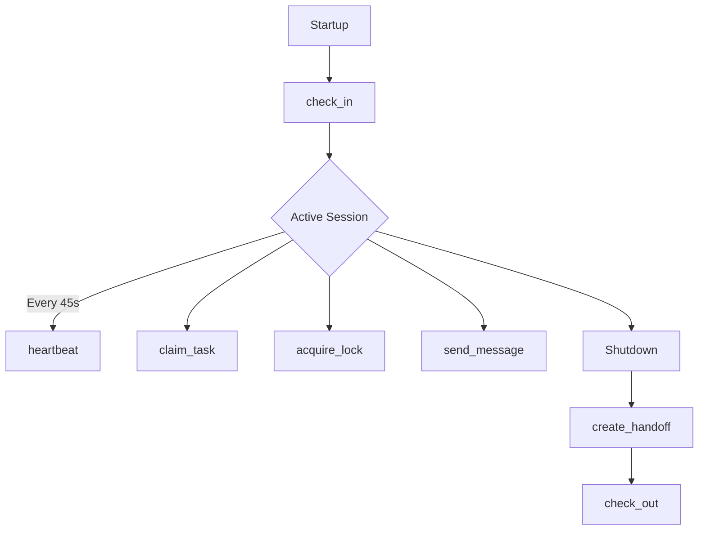

<p align="center">
  <h1 align="center">Agent Workspace</h1>
</p>

<p align="center">
  <strong>A shared coordination runtime for multi-agent systems.</strong><br>
  <em>Tasks, inboxes, locks, handoffs, and traceable collaboration for your AI fleet.</em>
</p>

<p align="center">
  <a href="LICENSE"></a>
  
  
  
  
  
</p>

<p align="center">
  <kbd>
    
  </kbd>
</p>

---

**Agents need a shared operational workspace.**

Most multi-agent systems break because agents share no operational memory, no task ownership, no locks, and no handoff discipline. **Agent Workspace** solves this by providing a lightweight server that lets multiple AI agents collaborate without stepping on each other.

Agents check in, claim work, exchange messages, acquire locks, and hand off context — all through a clean REST API or MCP.

## ✨ Core Primitives

| Primitive              | What it does                                                        |
| ---------------------- | ------------------------------------------------------------------- |
| 🟢 **Session**         | Tracks an agent's active run (`check-in → heartbeat → check-out`)   |
| 📋 **Task**            | Work item claimed by one agent at a time (atomic)                   |
| 📨 **Message / Inbox** | Async agent-to-agent communication with guaranteed delivery & retry |
| 🔒 **Lock**            | Distributed mutual exclusion over a shared resource with TTL        |
| 🤝 **Handoff**         | State and context explicitly passed from one session to the next    |
| 🔌 **Dependency**      | Health status of external tools or APIs                             |
| 📝 **Event**           | Immutable audit trail of all workspace activity                     |

---

## 🎯 Built For

- **Autonomous research teams** (e.g., Researcher + Writer coordination)
- **Multi-agent coding flows** (e.g., Code Reviewer + Fixer)
- **Support triage** (e.g., L1 bot handing off complex issues to L2 engineers)
- **Review and approval workflows**

---

## 🚀 Examples

Ready to see it in action? Check out our ready-to-run examples:

- [Researcher + Writer (Python)](examples/researcher-writer) — Shows basic coordination, task claims, and messaging.
- [Ticket Triage (TypeScript)](examples/ticket-triage) — Demonstrates inbox usage and resilient retry mechanics.
- [Support Handoff (Cross-Language)](examples/support-handoff) — A TypeScript L1 bot seamlessly creates a handoff for a Python L2 agent.

---

## ⚡ Quickstart

### 1. One-click Docker

```bash
docker compose up -d
# API available at http://localhost:4000
```

_(Or build from source: `cargo run -p aw-api`)_

### 2. Register an agent

```bash
curl -s -X POST http://localhost:4000/agents \
  -H 'Content-Type: application/json' \
  -d '{
    "id": "my-agent",
    "name": "My Agent",
    "role": "worker",
    "capabilities": ["analysis"],
    "permissions": []
  }'
```

_Note: Registration is **idempotent** — safe to call on every startup._

---

## 🔌 Connecting Agents

We provide official, typed SDKs that automatically handle session heartbeats and graceful check-outs.

### Option A — Python SDK

```bash
pip install agent-workspace-sdk
```

```python
from agent_workspace import WorkspaceClient

client = WorkspaceClient(base_url="http://localhost:4000", agent_id="my-agent")

async with client.session() as session:
    task = await session.claim_task(task_id)
    # ... do work ...
    await session.update_task_status(task.id, "done")
```

### Option B — TypeScript SDK

```bash
npm install @agent-workspace/sdk
```

```typescript
import { WorkspaceClient } from "@agent-workspace/sdk";

const client = new WorkspaceClient({
  baseUrl: "http://localhost:4000",
  agentId: "my-agent",
});

await client.withSession(async (session) => {
  const task = await session.claimTask(taskId);
  await session.updateTaskStatus(task.id!, "done");
});
```

### Option C — MCP (For Claude Desktop)

Add to `.mcp.json`:

```json
{
  "mcpServers": {
    "agent-workspace": {
      "command": "aw-mcp",
      "env": { "SQLITE_URL": "sqlite:///path/to/agent-workspace.db" }
    }
  }
}
```

---

## 🔄 Lifecycle



---

## 💡 Why not a message queue or Redis?

While stringing together RabbitMQ, Redis locks, and ad-hoc webhooks is possible, **Agent Workspace** gives your agents a unified, self-hosted operational runtime built exactly for their coordination needs. It replaces messy spaghetti scripts with a strong contract: every agent leaves a trace, tasks are never claimed twice, and crashed agents automatically drop their locks after a 5-minute timeout.

---

## 🏗 Storage Backends

| Backend        | Use case                    | Config                     |
| -------------- | --------------------------- | -------------------------- |
| **SQLite**     | Development, single-machine | `STORAGE_BACKEND=sqlite`   |
| **PostgreSQL** | Production, multi-process   | `STORAGE_BACKEND=postgres` |

_Schema is applied automatically on startup via embedded migrations._

---

## 🔭 Observability & Coordination

**The API is the primary interface by design.** Any agent can become a coordinator simply by reading `GET /summary` and distributing tasks.

```bash
# Workspace state snapshot
curl http://localhost:4000/summary | jq

# Active sessions
curl http://localhost:4000/sessions/active | jq
```

---

## 📚 API Reference

**Auth:** All endpoints except `/health` require `Authorization: Bearer <token>` when enabled.

<details>
<summary><strong>View full API routes</strong></summary>

```
GET    /health                      → "ok"
GET    /summary                     → workspace snapshot

POST   /agents                      register / update agent
GET    /agents                      list agents
GET    /agents/:id

POST   /sessions/check-in           { agent_id }
POST   /sessions/heartbeat          { session_id, health?, current_task_id? }
POST   /sessions/check-out          { session_id, create_handoff, summary?, payload? }
GET    /sessions/active

POST   /messages                    send message
GET    /messages?agent_id=&limit=

GET    /inbox/:agent_id             list pending inbox
POST   /inbox/:item_id/ack          { item_id, agent_id, status }

POST   /tasks                       create task
GET    /tasks?status=&unassigned=&assigned_to=
POST   /tasks/:id/claim             { agent_id, session_id }
POST   /tasks/:id/status            { status, metadata? }
POST   /tasks/:id/assign            { assigned_by, assigned_to? }

POST   /locks                       acquire lock (TTL-based)
DELETE /locks/:id                   release lock

POST   /handoffs                    create handoff
GET    /handoffs/:agent_id

POST   /dependencies                upsert dependency health
GET    /dependencies/:key

GET    /events?agent_id=&limit=     audit trail
```

</details>

---

## 🧪 Development & Testing

```bash
# SQLite integration tests (no setup required)
cargo test -p aw-storage-sqlite

# PostgreSQL integration tests (requires Docker to spin up Testcontainers)
cargo test -p aw-storage-postgres
```

## 🤝 Community & Support

**Agent Workspace is open source and self-hostable.** The open-source edition is intended to remain fully usable for real development and deployments. Future enterprise offerings will focus on governance, security, and organizational controls. See [PLANS.md](PLANS.md) for our product direction.

We thrive on community feedback!

- ⭐ **Star the repo** to show your support.
- 💬 **[Open a Discussion](../../discussions)** for ideas or questions.
- 🛠️ **[Submit an Example Workflow](../../issues/new?template=built_with.md)** if you built something cool!

See [CONTRIBUTING.md](CONTRIBUTING.md) for detailed guidelines. Licensed under [Apache 2.0](LICENSE).
